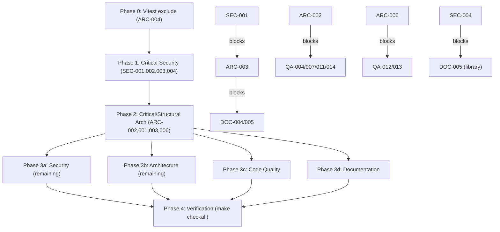

# Project Audit Report

> **Project**: Stable Audio 3 Lab
> **Date**: 2026-07-10
> **Stack**: TypeScript / Next.js 16 (App Router, React 19), Python 3 (audio bridge + Qwen assessor), Swift 6 (Pardora iOS/watchOS/CarPlay), MLX/PyTorch inference
> **Audited by**: Claude Code Audit System (Fable subagents)

---

## Executive Summary

Stable Audio 3 Lab is a capable, feature-rich local audio lab whose **library layer is genuinely well-crafted** (pure, immutable, well-tested functions in `lib/`), but whose **impure orchestration has concentrated into a single 1,568-line radio route** that carries the project's highest-risk logic: unsynchronized, non-atomic writes to a shared JSON state file that is **silently reset to defaults on any corrupt read**, plus a machine-specific TTS dependency loaded through a `new Function` eval indirection. The most critical finding is cross-cutting: **the entire mutating, subprocess-spawning API surface is completely unauthenticated** while the app binds to `0.0.0.0` and is explicitly designed for public exposure at `radio.pardev.net` — turning an autonomous `codex exec` prompt-injection path and unbounded model-inference DoS into remotely triggerable attacks. Remediating the top tier (auth boundary, deterministic YouTube extraction, atomic locked state store, declared TTS dependency, one-line vitest exclude fix) is an estimated 3–5 focused days and should precede any cosmetic work. The project's real strength is its disciplined functional core and consistent filesystem-boundary security (`isSafeAudioFilename` applied everywhere, no shell injection, escaped SVG output).

### User-Directed Focus

No specific focus areas were provided; this was a full-spectrum audit across architecture, security, code quality, and documentation.

### Issue Count by Severity

| Severity | Architecture | Security | Code Quality | Documentation | Total |
|----------|:-----------:|:--------:|:------------:|:-------------:|:-----:|
| 🔴 Critical | 2 | 2 | 3 | 2 | **9** |
| 🟠 High     | 4 | 2 | 6 | 5 | **17** |
| 🟡 Medium   | 6 | 3 | 8 | 6 | **23** |
| 🔵 Low      | 4 | 2 | 5 | 5 | **16** |
| **Total**   | **16** | **9** | **22** | **18** | **65** |

> **Note on overlap**: Several root issues were independently found by multiple domains. The most important duplicates are tracked once in the Remediation Plan and cross-referenced here:
> - **Radio state races / silent wipe**: ARC-002 ≡ QA-003
> - **Hardcoded TTS path via `new Function`**: ARC-001 ≡ QA-005 ≡ SEC-007
> - **Radio god module**: ARC-003 ≡ QA-008
> - **Cross-route `generateTitle` import**: ARC-006 ≡ QA-013
> - **God components**: ARC-010 ≡ QA-009
> - **Triplicated subprocess runners**: ARC-007 ≡ QA-010
> - **Misnamed `experiment-features.test.ts`**: ARC-018-note ≡ QA-016 ≡ DOC-018
> - **No linter/formatter**: ARC-013 ≡ QA-018

---

## 🔴 Critical Issues (Resolve Immediately)

### [SEC-001] Entire mutating + subprocess-spawning API surface is unauthenticated and publicly exposed
- **Area**: Security
- **Location**: `app/api/radio/route.ts` (POST actions ~116–343), `app/api/generate/route.ts:13`, `app/api/library/route.ts:109` (DELETE), `app/api/library/crop/route.ts:14`, `app/api/assess/*`; `package.json` (`next dev/start -H 0.0.0.0`); `next.config.ts` (`radio.pardev.net` → `/radio`)
- **Description**: No route performs any authentication or authorization. The server binds to all interfaces and is designed to be published publicly. The radio POST handler alone exposes `deleteTrack`, `deleteStyle`, `deleteFeedback`, `configure`, `createStyle`, `updateStyle`, `draftStyle`, `rating`; `DELETE /api/library` unlinks files from `public/outputs/`.
- **Impact**: Anyone on the LAN (or the internet, if the tunnel forwards `/api/*`) can wipe the station, hijack TTS provider/voice config, or destroy generated content with unauthenticated requests.
- **Remedy**: Gate non-public routes behind auth (shared-secret bearer token checked in `middleware.ts`), or bind to `127.0.0.1` and require the public tunnel/iOS client to authenticate. Split the read-only public radio stream/state from the mutating action surface; do not forward `/api/radio` POST through the public tunnel.

### [SEC-002] Prompt injection into an autonomous `codex exec` agent with `--sandbox workspace-write` and `approval_policy=never`
- **Area**: Security
- **Location**: `app/api/assess/youtube/route.ts:63–137` (`runCodexYouTubeExtraction` / `buildCodexExtractionPrompt`); related read-only agents in `app/api/radio/route.ts:894–945` fed by `lib/radio.ts:440` and `:636`
- **Description**: The YouTube reference flow spawns Codex (an autonomous coding agent) with a workspace-writable sandbox and approvals disabled, embedding an attacker-controlled URL directly into the natural-language prompt (`URL: ${url}`). Argument passing is an array (no shell injection), but the agent itself acts on instructions in its prompt/tool output and has write access to the repo tree with no human gate.
- **Impact**: A crafted URL or a fetched page whose title/description carries agent-directed instructions can make Codex write/modify files in the repo. Combined with SEC-001, this is remotely triggerable.
- **Remedy**: Replace the Codex YouTube extraction with a deterministic `yt-dlp`/`ffmpeg` subprocess (fixed args, no LLM). If Codex must be used, keep it `read-only`, keep approvals on, and never place untrusted text in the agent prompt.

### [ARC-001] Undeclared out-of-tree TTS dependency loaded via hardcoded absolute path + `new Function` eval  *(≡ QA-005, SEC-007)*
- **Area**: Architecture
- **Location**: `app/api/radio/route.ts:1478-1479, 1535-1537`; must also touch `package.json`
- **Description**: The radio TTS pipeline defaults to `/Users/probello/Repos/par-tts-core-ts/dist/...` — a machine-specific path to a package absent from `package.json` — and loads it through `new Function("createRequireFn", ...)`, an eval indirection built to defeat the bundler's static analysis. `TtsModule` is a hand-maintained structural type that can drift from the real module.
- **Impact**: DJ announcements silently work only on this one machine; any clone, CI runner, or deployment loses the feature or fails at runtime. The `new Function` wrapper hides the dependency from `next build` tracing and type checking.
- **Remedy**: Declare the dependency (`"par-tts-core-ts": "file:../par-tts-core-ts"` or publish it), import it normally, and add to `serverExternalPackages` if bundling is the concern. If it must stay optional, require `RADIO_TTS_MODULE_PATH` explicitly and fail with a clear config error instead of defaulting to a personal path. **Flag for manual review**: the fix must not change how TTS API keys resolve (`~/.claude/.env` fallback).

### [ARC-002] Radio state file has unsynchronized read-modify-write, non-atomic writes, and silent reset on corruption  *(≡ QA-003)*
- **Area**: Architecture / Code Quality
- **Location**: `app/api/radio/route.ts:998-1022` (`readRadioState`/`writeRadioState`), `:518-534` (`maintainRadioQueue`), `:827` (`advanceStreamStateAfterTrack`); same pattern in `lib/audio-assessment.ts:388-400`
- **Description**: `.stable-audio-radio/state.json` is the single source of truth (queue, taste profile, custom styles, ratings) mutated concurrently by POST handlers, the background queue loop (holding a stale snapshot across multi-minute generations), and per-listener stream advancement — with no lock and no temp-file+rename. `readRadioState` catches **all** errors including a torn read and returns `defaultRadioState()`.
- **Impact**: Lost-update races (a thumbs-up recorded during generation is overwritten by the loop's stale snapshot); a crash mid-write followed by any read **silently wipes all station state** with no error surfaced.
- **Remedy**: (1) Write atomically (`state.json.tmp` → `rename`). (2) Serialize all mutations through a single in-process promise-chain/mutex, re-reading state inside the critical section. (3) Distinguish ENOENT (return defaults) from parse errors (back up the corrupt file and log loudly).

### [QA-001] Poison-pill job permanently blocks the audio assessment queue
- **Area**: Code Quality
- **Location**: `lib/audio-assessment.ts:205-221`
- **Description**: On failure the job is re-queued at the **head** and processing stops. The `attempts` counter is incremented but **never read** — no cap, no backoff, and the failure path returns `deferred: false` so no retry is scheduled.
- **Impact**: One consistently-failing track (corrupt file, model OOM) starves every job behind it forever; the persisted `queue.json` carries the poison job across restarts.
- **Remedy**: Check `attempts` against a cap (e.g. 3), drop/dead-letter when exceeded, and requeue failures at the tail.

### [QA-002] Missing `spawn` error handler hangs generation requests
- **Area**: Code Quality
- **Location**: `app/api/generate/route.ts:54-70`, `app/api/radio/route.ts:602-618`
- **Description**: `runProcess` and `runStableAudioGeneratorProcess` attach `close` handlers but no `error` handler. A missing Python binary (`ENOENT`) emits `error` without `close`, so the Promise never resolves. `runAssessorCommand` (`lib/audio-assessment.ts:475-478`) already does this correctly — the pattern is applied inconsistently.
- **Impact**: Requests hang until `maxDuration` (900s for generate); radio queue maintenance silently stalls.
- **Remedy**: Add `child.on("error", ...)` that clears the timer and resolves with a non-zero code, matching `runAssessorCommand`. Fix together with QA-010 (consolidate the runners) to avoid recreating the divergence.

### [QA-003] Unsynchronized read-modify-write of shared JSON state with silent wipe on corruption
- **Area**: Code Quality
- **Location**: `app/api/radio/route.ts:998-1022`, `lib/audio-assessment.ts:388-400`
- **Description**: The code-quality view of ARC-002 — also covers the assessment queue file between `enqueueAudioAssessment` and the processor. **Tracked and fixed as ARC-002** (state-store extraction with locking + atomic writes).
- **Remedy**: See ARC-002.

### [DOC-001] Radio station subsystem is entirely undocumented in the README
- **Area**: Documentation
- **Location**: `README.md`
- **Description**: The continuous AI radio station (`app/api/radio/route.ts` 1,568 lines, `lib/radio.ts` 1,481 lines, `app/radio/` page, multi-provider TTS DJ announcements, taste distillation, LAN/public streaming) is mentioned only twice in passing. `CLAUDE.md` claims "README.md is the current source of truth for full feature detail" — false today.
- **Impact**: No one but the author can discover, configure, or run the radio station without reading a 3,000-line source pair; blocks Pardora onboarding.
- **Remedy**: Add a "Radio Station" README section: what it is, how to open the page, stream/playlist URLs, TTS provider config and API-key fallback (`~/.claude/.env`), taste-profile behavior, and the queue/auto-fill model. Update TOC and Roadmap.

### [DOC-002] Environment variable reference is missing ~20 variables the code reads
- **Area**: Documentation
- **Location**: `README.md` (Environment Variables), `.env.example`
- **Description**: Missing from both docs: `RADIO_CODEX_BIN`, `RADIO_CODEX_STYLE_MODEL`, `RADIO_CODEX_TASTE_MODEL`, `RADIO_CODEX_TASTE_TIMEOUT_MS`, `RADIO_LAN_HOST`, `RADIO_PUBLIC_ORIGIN`, `RADIO_QUEUE_AUTO_FILL`, `RADIO_TTS_MODEL`, `RADIO_TTS_MODULE_PATH`, `RADIO_TTS_NODE_MODULE_PATH`, `RADIO_OLLAMA_TIMEOUT_MS`, `RADIO_OLLAMA_MODELS_TIMEOUT_MS`, `OPENAI_API_KEY`, `ELEVENLABS_API_KEY`, `DEEPGRAM_API_KEY`/`DG_API_KEY`, `PAR_TTS_CONFIG_PATH`, `LAN_IP`, `FFMPEG_PATH`, `FFPROBE_PATH`, `OLLAMA_BASE_URL`, `OLLAMA_HOST`, `QWEN_OMNI_DEVICE_MAP`, `QWEN_OMNI_DTYPE`, `QWEN_OMNI_MAX_NEW_TOKENS`, `STABLE_AUDIO_MLX_TIMEOUT_MS`, `DEV_SERVER_RESTART_DELAY_MS`. `OLLAMA_TITLE_MODEL`/`OLLAMA_PORT` are in `.env.example` but not the README.
- **Impact**: Users cannot configure TTS, public streaming, Ollama endpoints, or assessor tuning without grepping source; misconfig failures are undiagnosable.
- **Remedy**: Enumerate every `process.env.*` / `os.environ` read; add each to `.env.example` with a comment and default; mirror the full list in the README grouped by subsystem.

---

## 🟠 High Priority Issues

### Security

### [SEC-003] Unauthenticated resource-exhaustion / DoS via heavy subprocess spawning
- **Location**: `app/api/generate/route.ts:41` (900s inference), `app/api/radio/route.ts:302` (`rating`→Codex on every thumbs-down), `app/api/assess/*` (Qwen), `app/api/library/crop/route.ts` (ffmpeg)
- **Description**: No rate limiting or concurrency cap; each unauthenticated request can launch a long-running, memory-heavy child process.
- **Impact**: A trivial POST loop starves CPU/RAM/GPU and fills `public/outputs/`.
- **Remedy**: Per-client rate limiting + a global concurrency semaphore for subprocess-spawning routes; require auth (SEC-001); cap `public/outputs/` disk usage.

### [SEC-004] Information disclosure: subprocess stdout/stderr and internal errors returned to clients and persisted in metadata
- **Location**: `app/api/generate/route.ts:44` (`detail: { ...result }`), `app/api/library/crop/route.ts:32`, raw `error.message` in most catch blocks; `lib/library.ts:29,116` persists the full Python `ProcessResult` into sidecars served by `GET /api/library` and bundle ZIPs
- **Description**: Backend process output and exception messages (host paths, tracebacks, tool errors) are echoed to responses and baked into downloadable metadata.
- **Impact**: Attackers enumerate absolute paths, tracebacks, and backend config via failing requests or downloaded bundles.
- **Remedy**: Return generic errors to clients, log details server-side only; strip stdout/stderr from persisted sidecars and `GET /api/library` responses.

### Architecture

### [ARC-003] `app/api/radio/route.ts` is a 1,568-line god module  *(≡ QA-008)*
- **Location**: `app/api/radio/route.ts`
- **Description**: One route file mixes HTTP handling, a 16-way action dispatcher, three subprocess integrations (generator, `codex`, ffmpeg), ICY/MP3 byte-level streaming, JSON persistence, an Ollama HTTP client, TTS synthesis, and library-fallback scanning (~70 functions). `lib/radio.ts` did the right thing; the impure orchestration piled up in the route.
- **Impact**: The most complex subsystem is only testable through a 1,535-line route test; no services are reusable (the YouTube route re-implements pieces).
- **Remedy**: Extract into `lib/server/`: `radio-state-store.ts` (fixes ARC-002 in the same move), `radio-queue-service.ts`, `radio-stream.ts`, `radio-tts.ts`, `codex-client.ts`, `ollama-client.ts`. Route shrinks to parse + dispatch.

### [ARC-004] Vitest runs stale duplicate test suites from `.claude/worktrees/`
- **Location**: `vitest.config.ts:15`
- **Description**: The exclude covers `**/.worktrees/**` but not `.claude/worktrees/**`. Verified: the full suite from `.claude/worktrees/agent-a8b0d1d5559ec388d/` (stale, divergent — its `page.tsx` is 1,602 vs 1,721 lines) is collected and executed alongside the real one.
- **Impact**: `make test`/`make checkall` does ~double the work and can fail the authoritative gate for reasons unrelated to the real code; skews coverage/timing. **Blocks verification for all other fixes.**
- **Remedy**: Add `"**/.claude/worktrees/**"` to the vitest exclude; clean up abandoned worktrees under `.claude/worktrees/` and `.worktrees/`.

### [ARC-005] Concurrency control relies on module-scope singletons; generation has no admission control
- **Location**: `app/api/radio/route.ts:87` (`radioQueueMaintenance` Map), `lib/audio-assessment.ts:74-75` (`queueProcessor`, `retryTimer`)
- **Description**: "Only one maintenance loop / one processor" invariants live in module-level variables. Next.js HMR re-instantiates route modules (parallel loops against the same state file), and `/api/generate` has no guard — N concurrent POSTs spawn N Python inferences while the radio loop can also be generating.
- **Impact**: On Apple Silicon, two or three concurrent inferences exhaust unified memory; overlapping loops compound ARC-002 races.
- **Remedy**: A single generation-slot semaphore shared by `/api/generate`, radio queue, and assessments; pin singletons to `globalThis` keyed by name so they survive HMR.

### [ARC-006] Cross-route imports and a duplicated Ollama client  *(≡ QA-013)*
- **Location**: `app/api/generate/route.ts:8`, `app/api/generate-title/route.ts:19-50`, `app/api/radio/route.ts:453-501`
- **Description**: `generate/route.ts` imports `generateTitle` from another **route** module (route files are framework entry points; typed-routes validation rejects extra exports). The radio route re-implements its own Ollama URL builders/request handling.
- **Impact**: Framework-upgrade fragility; two Ollama base-URL/env resolvers that can drift.
- **Remedy**: Move `generateTitle`, `cleanTitle`, and URL builders into `lib/server/ollama.ts`; both routes import from there. Route files export only handlers and route config.

### Code Quality

### [QA-004] Segment push happens before existence verification in the stream loop
- **Location**: `app/api/radio/route.ts:741-750`
- **Description**: `segmentFiles.push({...})` runs **before** the `await readFile(...)` existence probe; on a missing announcement the `catch` does `continue`, but the file is already queued, so `readRadioStreamSegment` still tries to read/transcode it and fails. The verification read also loads the whole MP3 into memory and discards it, then it's read again (double full-file read per segment).
- **Remedy**: Verify with `stat` first; push only on success.

### [QA-005] Hard-coded machine-specific TTS path loaded via `new Function` require
- **Location**: `app/api/radio/route.ts:1533-1538, 1477-1480`
- **Description**: Code-quality view of ARC-001. **Tracked and fixed as ARC-001.**
- **Remedy**: See ARC-001.

### [QA-006] Project-wide silent error swallowing — 44 empty `catch {}` blocks, zero logging
- **Location**: throughout; densest in `app/api/radio/route.ts` (18)
- **Description**: No `console.error`/`console.warn` or logger in non-test server code. Operationally significant failures vanish: TTS synthesis (route.ts:1345-1347), Codex taste distillation (855-857), queue-refill generation (527-531), Ollama draft (468).
- **Impact**: The radio degrades (no announcements, no taste learning, repetitive prompts) with no way to diagnose why.
- **Remedy**: Introduce a minimal logger; emit warnings in every fallback path that changes behavior; keep empty catches only for true parse-or-default cases.

### [QA-007] Existence checks implemented as full reads and ffmpeg re-transcodes
- **Location**: `app/api/radio/route.ts:1374-1383` (`ensureMp3File`), `:1494-1501` (`fileExists`)
- **Description**: `fileExists` reads the whole file to test existence; `ensureMp3File` spawns ffmpeg to fully re-transcode and byte-compares on **every** announcement check — every stream start pays a full transcode of an unchanged file, and since transcoding isn't idempotent it likely rewrites the file each time.
- **Remedy**: `stat` for existence; validate MP3-ness once (header bytes or record in sidecar), not by re-transcoding.

### [QA-008] God module: `app/api/radio/route.ts` and its two giant functions
- **Location**: `app/api/radio/route.ts` — `POST` (228 lines, 14-action if-chain), `streamCurrentTrack` (161 lines, `while(true)`, ~6 nesting levels, 8 loop-carried mutable variables)
- **Description**: Code-quality view of ARC-003. **Tracked and fixed as ARC-003.**
- **Remedy**: See ARC-003.

### [QA-009] God components: `app/page.tsx` (1,721 lines) and `RadioStationClient.tsx` (1,531 lines)  *(≡ ARC-010)*
- **Location**: `app/page.tsx` (Home holds ~35 `useState`; `generate()` is 283 lines), `app/radio/RadioStationClient.tsx`
- **Description**: The entire UI lives in two files while `components/` sits empty; `page.tsx` mixes generation form, batch orchestration, library CRUD, comparison, reference-track analysis, and radio queueing state.
- **Impact**: Any UI change risks unrelated re-renders and merge conflicts; `RadioStationClient.tsx` has no tests (12 untested fetch sites).
- **Remedy**: Split by panel (Generator, Library, Comparison, Reference) into `components/`; group related state into `useReducer` slices or custom hooks; extract `generate()`'s batch loop into a lib function.

### Documentation

### [DOC-003] README "Project layout" is stale and omits half the codebase
- **Location**: `README.md`
- **Description**: The tree omits `app/radio/`, `app/api/radio/`, `app/api/generate-title/`, `lib/radio.ts`, `lib/radio-playlist-response.ts`, `lib/audio-assessment.ts`, `lib/assessment-prompt.ts`, `lib/metadata-settings.ts`, `scripts/audio_assessor_qwen_omni.py`, `scripts/dev-server.mjs`, `tests/`, `apps/pardora-ios/`, `skills/stable-audio/`, `CHANGELOG.md`, `docs/superpowers/`.
- **Remedy**: Regenerate the tree from the current repo with one-line purpose comments per entry.

### [DOC-004] No API reference for the `/api/radio` contract Pardora depends on
- **Location**: Missing (nearest: `docs/superpowers/specs/2026-05-27-pardora-ios-design.md`, `lib/radio-playlist-response.ts`)
- **Description**: Pardora consumes `GET /api/radio`, `GET /api/radio?stream=1`, and `POST /api/radio` actions, but the only written contract is a dated spec whose Non-Goals exclude features that now exist. No current endpoint reference exists for any route.
- **Remedy**: Add `docs/reference/api.md` covering all routes with request/response JSON and error tables; mark the 2026-05-27 spec historical.

### [DOC-005] Zero JSDoc on all 144 exported TypeScript APIs in `lib/`
- **Location**: `lib/radio.ts`, `lib/library.ts`, `lib/audio-assessment.ts`, `lib/generation.ts`, `lib/generator-backend.ts`, `lib/metadata-settings.ts`, `lib/assessment-prompt.ts`, `lib/radio-playlist-response.ts`
- **Description**: 0 JSDoc blocks across 144 exports (`lib/radio.ts` alone: 83 exports, zero comments). Complex behaviors (queue state machine, taste distillation, load-throttled queue) carry no explanation of intent, invariants, or units.
- **Remedy**: Add JSDoc to exported functions/types in the three large modules first (`radio.ts`, `audio-assessment.ts`, `library.ts`): one-line purpose + param/return notes where non-obvious, plus a module-level header per file.

### [DOC-006] Changelog has no released-version history despite v0.1.0
- **Location**: `CHANGELOG.md`
- **Description**: Declares Keep a Changelog + SemVer but contains only `[Unreleased]` with three entries; `package.json` is `0.1.0`, no git tags, the entire radio/assessment/Pardora history unrecorded. The README "What's new — v0.1.0" is a competing changelog.
- **Remedy**: Backfill `[0.1.0]` (README blurb is a ready source), record radio/assessment/Pardora, tag releases, link the README to CHANGELOG.md instead of duplicating.

### [DOC-007] Pardora iOS app has no README
- **Location**: `apps/pardora-ios/` (no `.md` files)
- **Description**: A Swift 6 app with watch/CarPlay/Live Activity targets has no prerequisites, build/run, or signing/TestFlight docs.
- **Remedy**: Add `apps/pardora-ios/README.md`: prerequisites (xcodegen, Xcode), `make pardora-*` workflow, target overview, signing, and the `/api/radio` contract pointer.

---

## 🟡 Medium Priority Issues

### Security

- **[SEC-005] No security headers / CSP on a publicly-served app** — `next.config.ts` has no `headers()` block: no CSP, `X-Content-Type-Options`, frame-ancestors, `Referrer-Policy`, and no `Origin`/`Referer` check on mutating JSON routes. *Remedy*: add a `headers()` config plus an origin check on mutating routes.
- **[SEC-006] Cross-application secret harvesting from `~/.claude/.env`** — `app/api/radio/route.ts:1503-1568` (`readLocalEnvApiKey`) reads the user's global agent env for TTS keys, coupling the web app's trust boundary to global developer credentials. *Remedy*: load provider keys only from the app's own `.env.local`/process env.
- **[SEC-008] Configurable outbound base URL (SSRF-adjacent) for Ollama** — `app/api/generate-title/route.ts:47-50`, `app/api/radio/route.ts:475-500` (`OLLAMA_BASE_URL`/`OLLAMA_HOST`). Operator-controlled today; no allowlist. *Remedy*: keep the target server-config-only, pin to loopback by default, never let request data influence it.

### Architecture

- **[ARC-007] Five near-duplicate subprocess runners, all weaker than the Python side** *(≡ QA-010)* — `runProcess`, `runStableAudioGeneratorProcess`, `spawnRuntimeProcess` (×2), crop/assessment variants across six files; all SIGTERM-only, resolve only on `close`, no SIGKILL escalation. *Remedy*: one `lib/server/subprocess.ts` `runCommand(cmd, args, {timeoutMs, killGraceMs})` with SIGKILL escalation, used everywhere.
- **[ARC-008] Model contract duplicated across the TS/Python boundary** — model→MLX mapping in `lib/generator-backend.ts:20-24` and `scripts/generate_audio.py:23-33`; model id list in the Zod enum, `modelOptions`, and argparse `choices`. *Remedy*: make one side authoritative (pass `--dit/--decoder` from TS, or generate both from a shared `models.json`).
- **[ARC-009] `/api/radio` POST is a 16-action string-dispatched RPC with no input validation** — raw `body.label`/`body.seedPrompt` reads through sequential `if` blocks, inconsistent with the Zod-validated `/api/generate`. *Remedy*: a Zod discriminated union on `action` parsed once at the top of POST; export inferred types as the shared Pardora contract.
- **[ARC-010] Monolithic client components with useState sprawl; `components/` is empty** *(≡ QA-009)* — see QA-009.
- **[ARC-011] `lib/radio.ts` bundles four modules' worth of concerns (83 exports, 1,481 lines)** — types, style/voice catalogs, prompt builders, state machine, URL builders in one file (code itself is well-factored). *Remedy*: split into `lib/radio/` (`types.ts`, `styles.ts`, `state.ts`, `prompts.ts`, `tts.ts`, `urls.ts`) with an index re-export.
- **[ARC-012] Stream serving buffers whole files in memory per listener; listeners drive station state** — `app/api/radio/route.ts:620-834` reads entire tracks into memory per listener and advances global state on track end. Fine for single-household LAN; a memory/consistency problem for the public stream at >a few listeners. *Remedy*: a single station "ticker" owns state advancement; listeners are read-only subscribers streamed via `createReadStream`. Otherwise document the single-listener assumption.

### Code Quality

- **[QA-010] Triplicated process-runner and value-reader helpers** *(≡ ARC-007)* — plus `readString`/`readNumber`/`firstString`/`firstNumber` triplicated (`lib/library.ts:432-438`, `lib/audio-assessment.ts:528-540`, `app/api/radio/route.ts:1115-1122`), `hasFinishedAssessment` vs `hasAssessmentMetadata` near-duplicates, `transcodeToRadioMp3` vs `transcodeFilesToRadioMp3` ~80% shared. *Remedy*: one runner, one `lib/json-readers.ts`, unify the predicates. Fix with QA-002.
- **[QA-011] Streaming bitrate constant contradicts the transcode bitrate** — `RADIO_STREAM_BYTES_PER_SECOND = 24_000` (192 kbps) at route.ts:84 vs ffmpeg `-b:a 128k` (16,000 B/s) at :1387/:1423. Sleep-pacing and mid-track resume offset (:756) assume 192 kbps, so announcement segments are paced ~1.5× real-time and resume offsets land wrong. *Remedy*: one shared bitrate constant for both the ffmpeg arg and pacing math.
- **[QA-012] Untested modules on the primary generation path** — `app/api/generate`, `app/api/generate-title`, all three `app/api/library/*`, `RadioStationClient.tsx`, `lib/radio-playlist-response.ts` have no route/component tests. *Remedy*: add route tests mirroring `app/api/assess/route.test.ts` (temp cwd + env isolation already established).
- **[QA-013] Cross-route function import couples API routes** *(≡ ARC-006)* — `app/api/generate/route.ts:8` imports `generateTitle` from `generate-title/route`. *Remedy*: move into `lib/` (fixed by ARC-006).
- **[QA-014] Dead catch-rethrow and dedupe/id inconsistency** — `app/api/radio/route.ts:761-763` (`catch(e){throw e}` noise); `lib/audio-assessment.ts:148` vs `:157` (dedupe checks `filename` only but job `id` is `${filename}:${rating}`, so a re-rated track can never re-queue). *Remedy*: delete the rethrow; decide whether rating participates in identity and make the dedupe check match.
- **[QA-015] TOCTOU filename collision between radio maintenance and user generation** — `lib/library.ts:46-56` (`titleToFilename` does `readdir` then picks a free name); concurrent radio refill + user generation can both claim the same slug and overwrite. *Remedy*: reserve the name by creating the file with the `wx` flag (or a placeholder sidecar) at selection time.
- **[QA-016] Misleading test filename** *(≡ DOC-018)* — `lib/experiment-features.test.ts` tests `generation.ts`/`library.ts`; no `experiment-features.ts` exists. *Remedy*: fold into `generation.test.ts`/`library.test.ts` or rename.
- **[QA-017] Swift force unwrap on user-configurable input** — `apps/pardora-ios/Pardora/Services/RadioAppModel.swift:42` (`URL(string: serverOrigin)!`); an empty persisted `serverOrigin` crashes at model init. *Remedy*: guard/fallback to `RadioEndpointResolver.defaultPublicOrigin`.

### Documentation

- **[DOC-008] Title/auto-title feature undocumented in README** — `title`/`autoTitle`, `/api/generate-title` (Ollama phi4-mini), and title-derived filenames documented only in `CLAUDE.md`/skill. *Remedy*: document in quick-start and Output-and-metadata, including the Ollama prerequisite.
- **[DOC-009] Roadmap "Where we're going" is an empty section** — heading with no content; "Where we are" predates radio/assessment/Pardora. *Remedy*: populate or remove; refresh "Where we are".
- **[DOC-010] Assessment queue behavior undocumented; CLAUDE.md implies a constant is configurable** — the persisted load-throttled queue is described only in `CLAUDE.md`, and `AUDIO_ASSESSMENT_LOAD_THRESHOLD` is shown in env-var style but is a hardcoded exported constant in `lib/audio-assessment.ts`. *Remedy*: document queue behavior in the README; clarify in `CLAUDE.md` that the threshold is a code constant.
- **[DOC-011] Skill doc inaccuracies in `skills/stable-audio/SKILL.md`** — documents `-2`/`-3` duplicate suffix (actual `_2`/`_3`), a self-contradictory `autoTitle` description, and omits the `_sfx` slug suffix. *Remedy*: correct the suffix to `_N`, rewrite the autoTitle description, document `_sfx`.
- **[DOC-012] No troubleshooting guide** — FAQ covers concepts but no failure modes (gated-model 401s, missing ffmpeg/ffprobe, Ollama down, assessor first-run timeouts, MLX download failures, port 3007 conflicts, `codex`/`yt-dlp` absent). *Remedy*: add `docs/troubleshooting/common-errors.md` (symptom/cause/fix/verify); link from README.
- **[DOC-013] No CONTRIBUTING.md** — guidance limited to two README sentences. *Remedy*: add `CONTRIBUTING.md` (setup, verification gates, commit conventions, the no-formatter/typecheck-only stance).

---

## 🔵 Low Priority / Improvements

### Architecture
- **[ARC-013] No real linter or formatter** *(≡ QA-018)* — `npm run lint` = `tsc --noEmit`, `make fmt` is a no-op. *Remedy*: add ESLint (or Biome for lint+format) for 10k+ lines of TS.
- **[ARC-014] No CI pipeline** — no `.github/workflows/`; `make checkall` and pre-commit are the only gates, both machine-dependent. *Remedy*: a workflow running `make checkall` would catch env-coupled regressions like ARC-001.
- **[ARC-015] Repository hygiene** — a tracked Playwright artifact (`output/playwright/audio-assessment-radio.png`), the empty `components/` directory, and abandoned worktrees under `.worktrees/`/`.claude/worktrees/` (root cause of ARC-004). *Remedy*: untrack the artifact, remove/populate `components/`, delete abandoned worktrees.
- **[ARC-016] Config and content placement nits** — `lib/generation.ts` mixes the server Zod contract with UI copy (`controlTips`, `promptTemplateGroups`); scattered `process.env` reads; floating carets. *Remedy*: a `lib/server/config.ts` centralizing the ~15 `STABLE_AUDIO_*`/`RADIO_*`/`OLLAMA_*` vars; move UI copy out of the schema module.

### Security
- **[SEC-007] Dynamic module loading via `new Function` + `createRequire` from an env-configurable path** *(≡ ARC-001)* — `app/api/radio/route.ts:1478-1479`, `resolveRadioTtsModulePath` (`:1533`). *Remedy*: fixed by ARC-001 (normal dynamic `import()` of a declared dependency).
- **[SEC-009] iOS LAN host scanning over HTTP (design smell)** — `apps/pardora-ios/Pardora/Services/RadioEndpointResolver.swift:84-96` probes every host on the /24 over cleartext HTTP. ATS is correct (`NSAllowsLocalNetworking` only); acceptable for LAN but noisy. *Remedy*: prefer explicit config or mDNS/Bonjour discovery.

### Code Quality
- **[QA-018] No linter or formatter configured** *(≡ ARC-013)* — see ARC-013.
- **[QA-019] Client-side clamp bounds duplicated as magic numbers** — `app/page.tsx:94-96` hard-codes 380/50/12 duration/steps/cfg bounds that must mirror `normalizeGenerationRequest`. *Remedy*: export the limits from `lib/generation.ts`.
- **[QA-020] Slow micro-implementations** — `bytesEqual` per-byte loop (route.ts:1442, use `Buffer.compare`), table-less `crc32` (`lib/library.ts:440`, ~8× slower on multi-MB bundles), `write_mock_wav` per-frame `writeframes` (`scripts/generate_audio.py:54-67`). *Remedy*: batch/table these.
- **[QA-021] Python naming** — `class prepared_audio_path` (snake_case class used as a context manager) at `scripts/audio_assessor_qwen_omni.py:178`. *Remedy*: rename `PreparedAudioPath` or use `@contextmanager`.
- **[QA-022] Module-level mutable singletons** — `radioQueueMaintenance` (route.ts:87), `queueProcessor`/`retryTimer` (audio-assessment.ts:74-75) assume single-process. *Remedy*: at minimum a comment; ideally `globalThis`-pinned (see ARC-005).

### Documentation
- **[DOC-014] CLAUDE.md size claims have drifted** — says `page.tsx` "~1200 lines" (actual 1,721) and calls `lib/radio.ts` the "largest source file" (route.ts 1,568 and page.tsx 1,721 are larger). *Remedy*: drop brittle line counts or use qualitative descriptions.
- **[DOC-015] Sparse Python function docstrings** — ~8% coverage in `scripts/generate_audio.py`/`audio_assessor_qwen_omni.py` (good module docstrings, full type hints). *Remedy*: one-line docstrings on `terminate_process_tree`, `trim_generated_ids`, `sequence_has_prompt_prefix`, `normalize_assessment`.
- **[DOC-016] README setup steps hard-code the author's home directory** — `/Users/probello/...` in the MLX symlink script and `.env.local` example. *Remedy*: use `$(pwd)` or a `<REPO_ROOT>` placeholder.
- **[DOC-017] No architecture diagram** — *Remedy*: add `docs/architecture/system-overview.md` with a Mermaid diagram of the generation and radio data flows.
- **[DOC-018] `lib/experiment-features.test.ts` name matches no source module** *(≡ QA-016)* — see QA-016 (code change; owned by Code Quality, not Documentation).

---

## Detailed Findings

### Architecture & Design
Overall health: **Fair**. A clean functional core (`lib/radio.ts`, `lib/library.ts`, `lib/generation.ts` — pure, immutable, well-tested) is undermined by all impure orchestration concentrating into `app/api/radio/route.ts` (1,568 lines), which owns unsynchronized non-atomic state persistence (silently reset on corruption), a machine-local TTS dependency loaded via `new Function`, five duplicated subprocess runners, and a 16-action unvalidated RPC. The client mirrors this: two ~1,600-line components while `components/` sits empty. Verification is compromised by a vitest exclude gap that runs a stale worktree copy. Full issue list: ARC-001 … ARC-016 above.

### Security Assessment
Overall posture: **Poor** for any non-loopback exposure; **Fair** if strictly bound to localhost for a single trusted user. The dominant risk is that the entire mutating + subprocess-spawning API surface is unauthenticated while the app binds `0.0.0.0` and targets `radio.pardev.net`, which promotes the autonomous `codex exec` prompt-injection path (workspace-write, approvals off) and unbounded inference DoS into remotely triggerable issues. Filesystem-boundary hygiene is genuinely strong (see Positive Highlights). Full list: SEC-001 … SEC-009 above.

### Code Quality
Overall health: **Fair-to-Good** — strong library-layer craftsmanship (zero `any`, zero `@ts-ignore`, zero `console.log` debris, typed JSON readers, exemplary Python subprocess lifecycle) undermined by two God files and a systemic silent-failure convention (44 empty catches, zero logging). Three concurrency/lifecycle correctness bugs (poison-pill queue, spawn-error hang, state races) sit on hot paths. TODO/FIXME count is genuinely 0. Full list: QA-001 … QA-022 above.

### Documentation Review
Overall health: **Fair**. The generation-core README coverage is genuinely strong (verified-accurate curl examples, MLX install guide, FAQ) and `skills/stable-audio/SKILL.md` is near-reference-quality for `/api/generate`. But roughly a third of the codebase — the radio station and the reason Pardora exists — has no user-facing documentation, ~20 environment variables are undocumented, the project layout is stale, and there is zero JSDoc across 144 `lib/` exports. Full list: DOC-001 … DOC-018 above.

---

## Remediation Roadmap

### Immediate Actions (Before Next Deployment / Public Exposure)
1. **ARC-004** — add `.claude/worktrees/**` to the vitest exclude (one line; unblocks all verification).
2. **SEC-001** — introduce an auth boundary (bearer token in `middleware.ts` or bind to `127.0.0.1`); split public read-only stream from mutating actions.
3. **SEC-002** — replace the Codex YouTube agent with a deterministic `yt-dlp`/`ffmpeg` subprocess.
4. **ARC-002 / QA-003** — extract a locked, atomic-write radio state store; fix the silent-wipe on corruption.
5. **ARC-001 / QA-005** — declare the TTS dependency; remove the `new Function` load and hardcoded path (manual review of API-key resolution).
6. **QA-001, QA-002** — cap assessment retries (poison-pill); add `spawn` error handlers.
7. **SEC-004** — strip subprocess stdout/stderr from responses and persisted sidecars.

### Short-term (Next 1–2 Sprints)
1. **ARC-003 / QA-008** — extract radio route services into `lib/server/`; fold in QA-004, QA-006, QA-007, QA-011, QA-014 during the split.
2. **SEC-003, SEC-005, SEC-006** — rate limiting + concurrency semaphore (ARC-005), security headers/CSP, stop reading `~/.claude/.env`.
3. **ARC-006 / QA-013, ARC-007 / QA-010** — consolidate the Ollama client and subprocess runners into `lib/server/`.
4. **DOC-001, DOC-002, DOC-003, DOC-004, DOC-005** — README radio section, full env-var reference, regenerated layout, API reference, JSDoc.
5. **QA-009 / ARC-010, QA-012** — split God components; add route/component tests.

### Long-term (Backlog)
1. **ARC-008, ARC-009, ARC-011, ARC-012** — unify the model contract, Zod-validate the radio RPC, split `lib/radio.ts`, redesign multi-listener streaming.
2. **ARC-013 / QA-018, ARC-014** — add ESLint/Biome and a CI workflow running `make checkall`.
3. Remaining Medium/Low docs and code-quality polish (DOC-006 … DOC-017, QA-015 … QA-022, ARC-015, ARC-016).

---

## Positive Highlights

1. **Functional core, imperative shell** — `lib/radio.ts`, `lib/library.ts`, and `lib/generation.ts` are pure, immutable state-transition functions (max function ~32 lines) with excellent colocated test coverage (33 test files); mutation problems live only in the shell.
2. **Exemplary Python subprocess lifecycle** — `scripts/generate_audio.py` uses `start_new_session`, SIGTERM→SIGKILL escalation with grace periods, signal-handler restoration in `finally`, and loud failures — a model the TS side should copy.
3. **Consistent filesystem-boundary security** — `isSafeAudioFilename` (strict allowlist + `..` reject) and `isSafeBatchRunId` are applied at every route touching filenames; ZIP entry names are re-validated in `buildStoredZip`; SVG output is properly escaped; no `dangerouslySetInnerHTML`/`eval` in product code.
4. **No shell injection anywhere** — every `spawn` passes an argument array with no `shell:true` and no string interpolation; the assessor command tokenizer handles quotes/escapes from a trusted env var only.
5. **Strong validation at the primary boundary** — the `/api/generate` Zod schema with `superRefine` batch invariants and model-specific duration clamping (`normalizeGenerationRequest`) is exactly right.
6. **Secrets hygiene** — `.env`/`*.local` gitignored (`!.env.example` re-included), no real secret values in source, pre-commit runs `gitleaks` + `detect-private-key`, no build artifacts tracked.
7. **Clean client decoupling** — the Pardora iOS app is modern Swift 6 (`@MainActor`/`@Observable`, injected transports, `[weak self]`, a 960-line test suite) consuming the plain `/api/radio` JSON + standard MP3/ICY stream with zero app-specific server coupling.
8. **Verified-accurate docs where they exist** — README crop/bundle curl examples were confirmed against the route implementations, and `skills/stable-audio/SKILL.md` is near-reference-quality.

---

## Audit Confidence

| Area | Files Reviewed | Confidence |
|------|---------------|-----------|
| Architecture | ~30 (entry points, all routes, libs, manifests, configs) | High |
| Security | ~28 (all API routes, libs, Python scripts, iOS services, manifests, git history) | High |
| Code Quality | ~28 (largest files, all routes, libs, tests, Python, Swift) | High |
| Documentation | ~20 (README, CLAUDE.md, CHANGELOG, skill, specs, `.env.example`, docstring sampling) | High |

*All four domains reviewed the codebase directly with high confidence; no domain was degraded or retried.*

---

## Remediation Plan

> This section is generated by the audit and consumed directly by `/fix-audit`.
> It pre-computes phase assignments and file conflicts so the fix orchestrator
> can proceed without re-analyzing the codebase.

### Phase Assignments

#### Phase 0 — Verification Gate (Do First, One Line)
<!-- ARC-004 blocks verification for every other fix: until the stale worktree suite is excluded,
     make checkall runs and can fail on a divergent copy. This must land and be verified before any other phase. -->
| ID | Title | File(s) | Severity |
|----|-------|---------|----------|
| ARC-004 | Exclude `.claude/worktrees/**` from vitest | `vitest.config.ts` | High (blocking) |

#### Phase 1 — Critical Security (Sequential, Blocking)
<!-- Critical Security, plus High Security issues promoted here because they modify conflict files
     (generate route, library.ts, radio route) also targeted by Code Quality/Architecture. -->
| ID | Title | File(s) | Severity |
|----|-------|---------|----------|
| SEC-001 | Auth boundary for mutating/subprocess routes | `middleware.ts` (new), `package.json`, `next.config.ts`, all `app/api/**/route.ts` | Critical |
| SEC-002 | Replace Codex YouTube agent with deterministic yt-dlp/ffmpeg | `app/api/assess/youtube/route.ts` | Critical |
| SEC-004 | Strip subprocess stdout/stderr from responses + sidecars | `app/api/generate/route.ts`, `app/api/library/crop/route.ts`, `lib/library.ts` | High (promoted — conflict file) |
| SEC-003 | Rate limiting + concurrency cap on spawn routes | `app/api/generate/route.ts`, `app/api/radio/route.ts`, `app/api/assess/*`, `app/api/library/crop/route.ts` | High (promoted — conflict files) |

#### Phase 2 — Critical & Structural Architecture (Sequential, Blocking)
<!-- Restructure the codebase; must complete before line-level Code Quality/Security fixes in the same files.
     ARC-003 and ARC-006 are High but promoted: they move code that QA/SEC issues would otherwise edit. -->
| ID | Title | File(s) | Severity | Blocks |
|----|-------|---------|----------|--------|
| ARC-002 | Locked, atomic-write radio state store (fixes QA-003) | `app/api/radio/route.ts` → `lib/server/radio-state-store.ts` (new), `lib/audio-assessment.ts` | Critical | QA-004, QA-007, QA-011, QA-014, ARC-005 |
| ARC-001 | Declare TTS dependency; remove `new Function` + hardcoded path (fixes QA-005, SEC-007) | `app/api/radio/route.ts`, `package.json`, `next.config.ts` | Critical | — |
| ARC-003 | Extract radio route into `lib/server/` services (fixes QA-008) | `app/api/radio/route.ts` → `lib/server/{radio-queue-service,radio-stream,radio-tts,codex-client,ollama-client}.ts` (new) | High (promoted) | QA-004, QA-006, QA-007, QA-011, QA-014, DOC-004, DOC-005 |
| ARC-006 | Move `generateTitle`/Ollama client into `lib/server/ollama.ts` (fixes QA-013) | `app/api/generate/route.ts`, `app/api/generate-title/route.ts`, `app/api/radio/route.ts` → `lib/server/ollama.ts` (new) | High (promoted) | QA-012 |

#### Phase 3 — Parallel Execution
<!-- All remaining work, safe to run concurrently by domain once Phases 0–2 land.
     Note the File Conflict Map: radio route and library.ts are still touched by multiple 3x lanes. -->

**3a — Security (remaining)**
| ID | Title | File(s) | Severity |
|----|-------|---------|----------|
| SEC-005 | Security headers / CSP + origin check | `next.config.ts`, `middleware.ts` | Medium |
| SEC-006 | Stop reading `~/.claude/.env` for provider keys | `app/api/radio/route.ts` | Medium |
| SEC-008 | Pin Ollama base URL to loopback; no request influence | `app/api/generate-title/route.ts`, `app/api/radio/route.ts` | Medium |
| SEC-009 | Prefer mDNS/config over LAN HTTP subnet scan | `apps/pardora-ios/Pardora/Services/RadioEndpointResolver.swift` | Low |

**3b — Architecture (remaining)**
| ID | Title | File(s) | Severity |
|----|-------|---------|----------|
| ARC-005 | Generation-slot semaphore; globalThis-pinned singletons | `app/api/generate/route.ts`, `app/api/radio/route.ts`, `lib/audio-assessment.ts` | High |
| ARC-007 | Unify subprocess runners into `lib/server/subprocess.ts` (fixes QA-010) | `app/api/generate/route.ts`, `app/api/radio/route.ts`, `app/api/assess/youtube/route.ts`, `app/api/library/crop/route.ts`, `lib/audio-assessment.ts` | Medium |
| ARC-008 | Single authoritative model contract | `lib/generator-backend.ts`, `scripts/generate_audio.py`, `lib/generation.ts` | Medium |
| ARC-009 | Zod discriminated union for `/api/radio` POST | `app/api/radio/route.ts`, `lib/radio-playlist-response.ts` | Medium |
| ARC-011 | Split `lib/radio.ts` into `lib/radio/` | `lib/radio.ts` → `lib/radio/*` | Medium |
| ARC-012 | Single station ticker; stream via file handles | `app/api/radio/route.ts` | Medium |
| ARC-013 | Add ESLint/Biome (fixes QA-018) | `package.json`, `Makefile`, new config | Low |
| ARC-014 | CI workflow running `make checkall` | `.github/workflows/` (new) | Low |
| ARC-015 | Repo hygiene: untrack artifact, remove worktrees/empty dir | `output/playwright/`, `.worktrees/`, `.claude/worktrees/`, `components/` | Low |
| ARC-016 | Centralize env config; move UI copy out of schema | `lib/server/config.ts` (new), `lib/generation.ts` | Low |

**3c — Code Quality (all remaining)**
| ID | Title | File(s) | Severity |
|----|-------|---------|----------|
| QA-001 | Cap assessment retries; dead-letter poison jobs | `lib/audio-assessment.ts` | Critical |
| QA-002 | Add `spawn` error handlers (with QA-010/ARC-007) | `app/api/generate/route.ts`, `app/api/radio/route.ts` | Critical |
| QA-004 | Verify segment with `stat` before push | `app/api/radio/route.ts` | High |
| QA-006 | Minimal logger; warn in behavior-changing fallbacks | `app/api/radio/route.ts` + others | High |
| QA-007 | `stat` for existence; validate MP3 once, not re-transcode | `app/api/radio/route.ts` | High |
| QA-009 | Split God components into `components/` (≡ ARC-010) | `app/page.tsx`, `app/radio/RadioStationClient.tsx` | High |
| QA-011 | Single shared bitrate constant | `app/api/radio/route.ts` | Medium |
| QA-012 | Route/component tests for generation path | `app/api/generate`, `app/api/generate-title`, `app/api/library/*`, `RadioStationClient.tsx` | Medium |
| QA-014 | Delete rethrow; fix dedupe/id mismatch | `app/api/radio/route.ts`, `lib/audio-assessment.ts` | Medium |
| QA-015 | Reserve filename with `wx` flag (TOCTOU) | `lib/library.ts` | Medium |
| QA-016 | Rename/fold `experiment-features.test.ts` (≡ DOC-018) | `lib/experiment-features.test.ts` | Medium |
| QA-017 | Guard Swift force unwrap on settings URL | `apps/pardora-ios/Pardora/Services/RadioAppModel.swift` | Medium |
| QA-019 | Export clamp limits from `lib/generation.ts` | `app/page.tsx`, `lib/generation.ts` | Low |
| QA-020 | Fast `bytesEqual`/`crc32`/`write_mock_wav` | `app/api/radio/route.ts`, `lib/library.ts`, `scripts/generate_audio.py` | Low |
| QA-021 | Rename `prepared_audio_path` class | `scripts/audio_assessor_qwen_omni.py` | Low |
| QA-022 | Comment/globalThis-pin module singletons (see ARC-005) | `app/api/radio/route.ts`, `lib/audio-assessment.ts` | Low |

**3d — Documentation (all)**
| ID | Title | File(s) | Severity |
|----|-------|---------|----------|
| DOC-001 | README Radio Station section | `README.md` | Critical |
| DOC-002 | Full env-var reference | `README.md`, `.env.example` | Critical |
| DOC-003 | Regenerate Project layout | `README.md` | High |
| DOC-004 | API reference for all routes | `docs/reference/api.md` (new), mark 2026-05-27 spec historical | High |
| DOC-005 | JSDoc on `lib/` exports (radio/audio-assessment/library first) | `lib/*.ts` | High |
| DOC-006 | Backfill CHANGELOG history + tags | `CHANGELOG.md` | High |
| DOC-007 | Pardora iOS README | `apps/pardora-ios/README.md` (new) | High |
| DOC-008 | Document title/autoTitle | `README.md` | Medium |
| DOC-009 | Populate/remove Roadmap | `README.md` | Medium |
| DOC-010 | Document assessment queue; fix threshold-as-env claim | `README.md`, `CLAUDE.md` | Medium |
| DOC-011 | Fix skill doc inaccuracies | `skills/stable-audio/SKILL.md` | Medium |
| DOC-012 | Troubleshooting guide | `docs/troubleshooting/common-errors.md` (new) | Medium |
| DOC-013 | CONTRIBUTING.md | `CONTRIBUTING.md` (new) | Medium |
| DOC-014 | Fix drifted CLAUDE.md size claims | `CLAUDE.md` | Low |
| DOC-015 | Python function docstrings | `scripts/generate_audio.py`, `scripts/audio_assessor_qwen_omni.py` | Low |
| DOC-016 | Replace hardcoded home paths in setup | `README.md`, `.env.example` | Low |
| DOC-017 | Architecture diagram | `docs/architecture/system-overview.md` (new) | Low |

### File Conflict Map
<!-- Files touched by issues in multiple domains. Fix agents MUST read current file state before editing —
     a prior phase/agent may already have changed these. Radio route is touched by all four domains. -->

| File | Domains | Issues | Risk |
|------|---------|--------|------|
| `app/api/radio/route.ts` | Security + Architecture + Code Quality (+ Docs via lib) | SEC-001, SEC-003, SEC-006, SEC-008, ARC-001, ARC-002, ARC-003, ARC-005, ARC-006, ARC-009, ARC-012, QA-002, QA-004, QA-006, QA-007, QA-011, QA-014, QA-020, QA-022 | ⚠️ Read before edit — heaviest conflict; Phase 2 extraction moves most of it |
| `app/api/generate/route.ts` | Security + Architecture + Code Quality | SEC-001, SEC-003, SEC-004, ARC-005, ARC-006, ARC-007, QA-002, QA-012 | ⚠️ Read before edit |
| `app/api/generate-title/route.ts` | Security + Architecture + Code Quality | SEC-008, ARC-006, QA-012 | ⚠️ Read before edit — moved into `lib/server/ollama.ts` in Phase 2 |
| `app/api/library/crop/route.ts` | Security + Architecture | SEC-003, SEC-004, ARC-007 | ⚠️ Read before edit |
| `app/api/assess/youtube/route.ts` | Security + Architecture | SEC-002, ARC-007 | ⚠️ Read before edit — SEC-002 rewrites it in Phase 1 |
| `lib/library.ts` | Security + Code Quality + Documentation | SEC-004, QA-015, QA-020, DOC-005 | ⚠️ Read before edit — SEC-004 changes metadata shape first |
| `lib/audio-assessment.ts` | Architecture + Code Quality + Documentation | ARC-002, ARC-005, ARC-007, QA-001, QA-014, DOC-005, DOC-010 | ⚠️ Read before edit |
| `lib/radio.ts` | Security + Architecture + Documentation | SEC-002 (prompt builders), ARC-011, DOC-005 | ⚠️ Read before edit — split in Phase 3b |
| `lib/generation.ts` | Architecture + Code Quality | ARC-008, ARC-016, QA-019 | ⚠️ Read before edit |
| `app/page.tsx` | Architecture + Code Quality | ARC-010, QA-009, QA-019 | ⚠️ Read before edit |
| `next.config.ts` | Security + Architecture | SEC-001, SEC-005, ARC-001 | ⚠️ Read before edit |
| `package.json` | Security + Architecture | SEC-001, ARC-001, ARC-013 | ⚠️ Read before edit |
| `CLAUDE.md` | Documentation | DOC-010, DOC-014 | Docs-only |
| `README.md` | Documentation | DOC-001, DOC-002, DOC-003, DOC-008, DOC-009, DOC-010, DOC-012, DOC-013, DOC-016 | Docs-only |

### Blocking Relationships
<!-- Explicit dependency declarations from the audit agents. Format: [blocker] → [blocked] — reason -->
- **ARC-004 → ALL**: until `.claude/worktrees/**` is excluded, `make checkall` verifies (and can fail on) a stale duplicate codebase. One-line fix; land and verify first.
- **SEC-001 → ARC-003, QA-008**: the auth middleware and the radio-route extraction both restructure `app/api/**/route.ts`; land the auth boundary before the extraction so both don't rewrite the same files.
- **SEC-002 → QA (youtube cleanup)**: SEC-002 rewrites `app/api/assess/youtube/route.ts`; any code-quality cleanup of that file waits.
- **SEC-004 → DOC-005, QA (library metadata)**: SEC-004 changes the `GenerationMetadata` shape in `lib/library.ts` (consumed by `app/api/library`, bundle, tests); do it before documenting or editing that contract.
- **ARC-002 → QA-004, QA-007, QA-011, QA-014, ARC-005**: the locked/atomic state store must land before any fix that adds new `writeRadioState` writers, or new writers widen the race window.
- **ARC-003 → QA-004, QA-006, QA-007, QA-011, QA-014, DOC-004, DOC-005**: the extraction moves the code those issues edit and changes the shapes DOC-004/DOC-005 would document; extract first.
- **ARC-006 → QA-012, QA-013**: moving `generateTitle` into `lib/server/ollama.ts` relocates the import QA-013 flags and the code QA-012 would test.
- **ARC-001 → manual review**: fixing the TTS dependency touches module loading and must not silently change TTS API-key resolution (`~/.claude/.env` fallback). Flag before committing.
- **QA-002 + QA-010/ARC-007 → fix together**: patching the missing `error` handler without consolidating the three runners recreates the divergence.
- **QA-016 / DOC-018 → Code Quality only**: this is a file rename (code change); documentation agents must not perform it.

### Dependency Diagram

