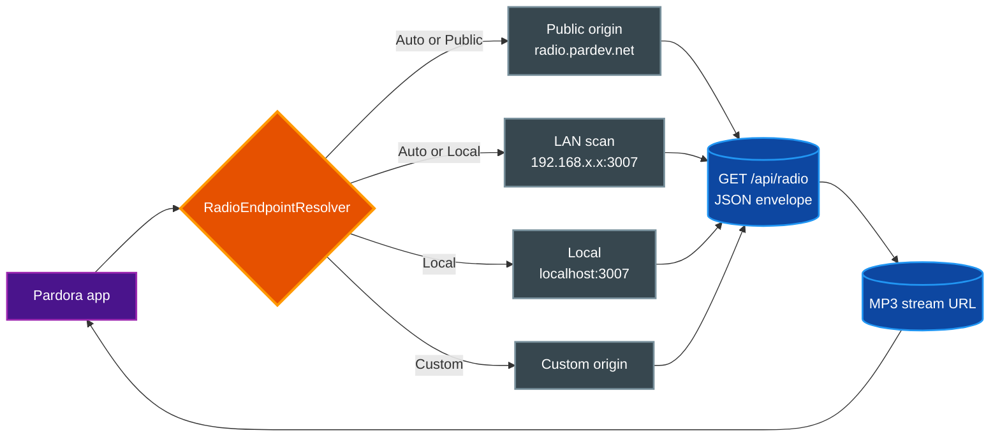

# Pardora — Stable Audio 3 Lab Radio Companion

Pardora is the native Swift 6 companion app that listens to the Stable Audio 3 Lab radio station from a phone, wrist, dashboard, or Live Activity. It consumes the existing `/api/radio` JSON envelope plus the MP3 stream URL and ships as iOS, watchOS, CarPlay, and Live Activity targets from one xcodegen-managed project, with no app-specific server API.

## Table of Contents

- [Features and targets](#features-and-targets)
- [Prerequisites](#prerequisites)
- [Getting started](#getting-started)
- [Commands](#commands)
- [Code signing](#code-signing)
- [Connecting to the station](#connecting-to-the-station)
- [Architecture notes](#architecture-notes)
- [Project layout](#project-layout)
- [Related documentation](#related-documentation)

## Features and targets

Pardora is generated from `project.yml` into four targets that share one Xcode project:

- **iOS app (`Pardora`, bundle `net.pardev.pardora`)** — the primary listener surface. A SwiftUI `TabView` shell with Now Playing, Queue, Memory, Styles, and Settings tabs, native `AVPlayer` playback, Like/Skip/Dislike feedback, queue management, music-style drafting, and a configurable radio endpoint. Deployment target iOS 17.0.
- **Live Activity extension (`PardoraLiveActivityExtension`, bundle `net.pardev.pardora.liveactivity`)** — a WidgetKit/ActivityKit extension that surfaces the now-playing track as a Live Activity on the Lock Screen and Dynamic Island.
- **watchOS app (`PardoraWatchApp`, bundle `net.pardev.pardora.watchapp`)** — a native watchOS application (deployment target watchOS 10.0) paired to the iOS app over `WatchConnectivity`.
- **CarPlay** — the iOS app links `CarPlay.framework` and declares the `com.apple.developer.carplay-audio` entitlement, so the station is controllable from a supported CarPlay dashboard via `PardoraCarPlaySceneDelegate`.

All targets compile under Swift 6.0 with automatic code signing. The app embeds the Live Activity extension and the watchOS app as dependencies of the iOS target.

## Prerequisites

- macOS on Apple Silicon (the host project's intended platform).
- A recent **Xcode** that ships the iOS 26.5 Simulator. The Makefile is pinned to the `iPhone 17 Pro Max` simulator on iOS 26.5; install that Simulator runtime via **Xcode > Settings > Components** if it is missing.
- **xcodegen**, used to materialize `Pardora.xcodeproj` from `project.yml`:

  ```bash
  brew install xcodegen
  ```

- Command-line developer tools (`xcode-select --install`).
- The **Stable Audio 3 Lab dev server** running and reachable. The default public origin is `https://radio.pardev.net`; for local development run `make dev` from the repo root so the app can find the station on your LAN at port 3007.
- For device installs and TestFlight: an **Apple Developer account** with a Team ID, a CarPlay-capable provisioning profile, and (for upload) an App Store Connect API key. See [Code signing](#code-signing).

> **Note:** CarPlay audio requires a provisioning profile that carries the CarPlay capability. Simulator builds do not exercise CarPlay; you must install on a device to validate the CarPlay scene.

## Getting started

All commands below run from the **repo root** (`stable-audio-3-lab/`). The `pardora-*` make targets are thin wrappers over `apps/pardora-ios/Makefile`.

1. **Generate the Xcode project** from `project.yml`. Do this first, and again whenever you edit `project.yml`.

   ```bash
   make pardora-generate
   ```

2. **Build** the `Pardora` scheme for the Simulator.

   ```bash
   make pardora-build
   ```

3. **Run** in the Simulator. This builds, boots the `iPhone 17 Pro Max` (iOS 26.5) simulator, installs the app, switches the simulator to dark appearance, and launches it.

   ```bash
   make pardora-run
   ```

For day-to-day work, `make pardora-generate && make pardora-run` is the usual loop. Open `apps/pardora-ios/Pardora.xcodeproj` in Xcode if you prefer the IDE for editing, debugging, or running on a real device.

## Commands

| Target | Purpose |
| --- | --- |
| `make pardora-generate` | Run `xcodegen generate` to (re)create `Pardora.xcodeproj` from `project.yml`. |
| `make pardora-build` | Build the `Pardora` scheme for the iOS Simulator. |
| `make pardora-test` | Run the `PardoraTests` unit-test bundle in the Simulator. |
| `make pardora-checkall` | Run `pardora-test` plus the TestFlight upload-script self-test. This is the iOS verification gate. |
| `make pardora-run` | Build, boot the `iPhone 17 Pro Max` simulator, install, set dark appearance, and launch. |
| `make pardora-archive-testflight` | Produce a signed `.xcarchive` for TestFlight via `scripts/testflight-upload.sh archive`. |
| `make pardora-upload-testflight` | Archive and upload the build to App Store Connect via `scripts/testflight-upload.sh upload`. |

The underlying `apps/pardora-ios/Makefile` also exposes finer-grained targets (`build-phone`, `install-phone`, `run-phone`, `build-simulator`, `run-simulator`, `export-existing`) that the root `pardora-*` targets build on.

## Code signing

Signing is automatic and driven by `project.yml` plus an export-options plist. You do not hand-edit entitlements or profiles for a standard build.

- **Team and style.** `project.yml` sets `CODE_SIGN_STYLE: Automatic` and a top-level `DEVELOPMENT_TEAM` that applies to every target. The export-options plist `Config/ExportOptions-TestFlight.plist` pins the same `teamID` for App Store distribution.
- **Entitlements.** The iOS app declares `com.apple.developer.carplay-audio` in `Pardora/Pardora.entitlements`. Live Activities are enabled per-target via `SUPPORTS_LIVE_ACTIVITIES: YES` and the extension's `NSSupportsLiveActivities` Info.plist key.
- **CarPlay profile.** CarPlay audio requires a provisioning profile that includes the CarPlay capability. `Signing/Pardora_Development_CarPlay.mobileprovision` is a committed development profile for that purpose; install it so Xcode can code-sign CarPlay development builds.
- **TestFlight export.** `Config/ExportOptions-TestFlight.plist` uses the `app-store-connect` method with automatic signing and symbol upload.

### Using your own team

To build or distribute under a different account, replace the team ID everywhere it is configured and provide your own CarPlay profile:

1. Set `DEVELOPMENT_TEAM` to `<DEVELOPER_TEAM_ID>` in `apps/pardora-ios/project.yml`.
2. Set `teamID` to `<DEVELOPER_TEAM_ID>` in `apps/pardora-ios/Config/ExportOptions-TestFlight.plist`.
3. Regenerate the project: `make pardora-generate`.
4. Replace `Signing/Pardora_Development_CarPlay.mobileprovision` with a profile issued by your team that carries the CarPlay capability.

### TestFlight upload

The upload script (`scripts/testflight-upload.sh`) archives with `xcodebuild archive`, then uploads with `xcodebuild -exportArchive` using the `Config/ExportOptions-TestFlight.plist`. The build number defaults to a timestamp (`TESTFLIGHT_BUILD_NUMBER`).

Uploads require an **App Store Connect API key**. Provide one of the following before running `make pardora-upload-testflight`:

```bash
export ASC_KEY_ID=<KEY_ID>
export ASC_ISSUER_ID=<ISSUER_ID>
export ASC_KEY_PATH=/path/to/AuthKey_<KEY_ID>.p8
```

`ASC_KEY_CONTENT` is accepted in place of `ASC_KEY_PATH` (the key is written to a temp file for the upload). The script can also resolve the key from `parvault` via the `PARVAULT_ASC_SECRET` secret name (defaults to `APPLE_APP_STORE_CONNECT`); see the script header for the full resolution order. Archive-only runs (`make pardora-archive-testflight`) do not upload.

## Connecting to the station

Pardora talks to the Stable Audio 3 Lab radio server over a plain JSON contract — there is no app-specific API. It reads the station state from `GET /api/radio` (current track, queue, available styles, stream and playlist URLs, TTS/announcement settings) and plays the MP3 stream URL returned in that envelope. The full route contract, request/response shapes, and action verbs live in [`docs/reference/api.md`](../../docs/reference/api.md).

The app picks a server origin through `RadioEndpointResolver`, which supports four modes selectable in the **Settings** tab:

- **Auto** (default) — uses the LAN stream URL when the device is on the same subnet as the server, otherwise falls back to the public origin.
- **Public** — always uses `https://radio.pardev.net`.
- **Local** — uses the LAN/local stream URL.
- **Custom** — uses any origin you type (validated as `http`/`https`).

When Auto or Local cannot reach a configured origin, the resolver **scans the local /24** on port 3007 in parallel batches to discover the dev server on your Wi-Fi. For this to find the Stable Audio 3 Lab server, run `make dev` from the repo root on a Mac on the same LAN and ensure the server is reachable from the device's subnet (not bound to loopback only).



The diagram shows how Pardora resolves a station origin by mode, then pulls state and the stream URL from the same `/api/radio` envelope.

## Architecture notes

- **Swift 6 concurrency.** `RadioAppModel` is `@MainActor` and `@Observable`; UI state mutates only on the main actor. Network monitoring uses `NWPathMonitor` with `[weak self]` capture so network changes re-apply the endpoint mode and refresh state without leaking the model.
- **Injectable transports.** `RadioAPIClient` depends on a `RadioTransport` protocol (with `URLSession` as the default conformance) and an optional `RadioActionClient`. Tests inject mock transports so model logic is exercised without real network calls.
- **Native playback.** `RadioPlayer` wraps `AVPlayer` with `AVAudioSession` handling, so background audio and interruptions behave like a first-party media app rather than a wrapped web view.
- **Server-decoupled.** The app treats the `/api/radio` response as the source of truth and mirrors only the fields it needs. The server is free to add fields; Pardora ignores unknown keys. There is no Pardora-specific server code to keep in sync.
- **Tests.** `PardoraTests/` covers model decoding (`RadioModelsTests`), the API client (`RadioAPIClientTests`), the app model and endpoint resolution (`RadioAppModelTests`), the player (`RadioPlayerTests`), the CarPlay scene delegate (`PardoraCarPlaySceneDelegateTests`), and settings persistence (`PardoraSettingsTests`). Run them with `make pardora-test`.

## Project layout

```text
apps/pardora-ios/
  project.yml                              xcodegen spec: targets, bundle IDs, signing
  Makefile                                 generate / build / test / run / TestFlight targets
  Config/
    ExportOptions-TestFlight.plist         app-store-connect export options (teamID, symbols)
  Signing/
    Pardora_Development_CarPlay.mobileprovision  development profile with CarPlay capability
  scripts/
    testflight-upload.sh                   archive + export + App Store Connect upload
    testflight-upload-test.sh              self-test for the upload script (fakes xcodebuild)
  Pardora/                                 iOS app target
    PardoraApp.swift                       @main entry; starts WatchConnectivity
    AppRootView.swift                      TabView shell
    Features/                              NowPlaying, Queue, Memory, Styles, Settings
    Services/                              RadioAppModel, RadioAPIClient, RadioPlayer,
                                           RadioEndpointResolver, CarPlay scene delegate,
                                           Live Activity controller, WatchConnectivity
    Models/                                Decodable radio models and app settings
    Resources/Info.plist                   generated-into app Info.plist
    Pardora.entitlements                   com.apple.developer.carplay-audio
  PardoraLiveActivityExtension/            WidgetKit/ActivityKit Live Activity
  PardoraWatchApp/                         native watchOS app
  PardoraTests/                            XCTest unit tests
```

## Related documentation

- [Root README](../../README.md) — full Stable Audio 3 Lab feature set, the radio station, and the `Pardora iOS App` section.
- [Radio API reference](../../docs/reference/api.md) — the complete `/api/radio` route contract that Pardora consumes.
- [Pardora iOS design spec](../../docs/superpowers/specs/2026-05-27-pardora-ios-design.md) — the original v1 design document. Treat it as a historical reference; the implementation has grown beyond its original scope (it now includes watchOS, CarPlay, and Live Activities, which the spec listed as non-goals).
