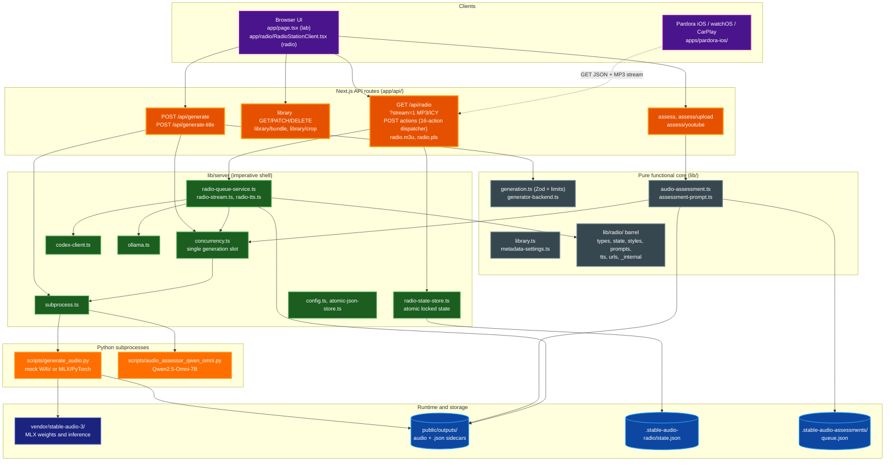
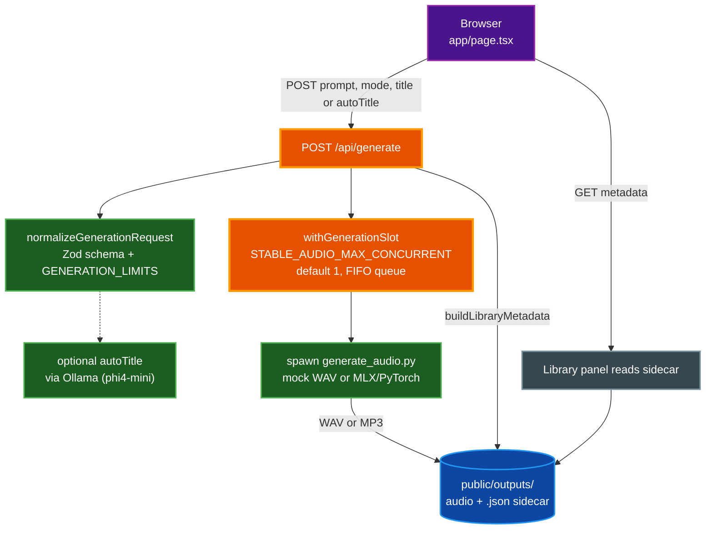
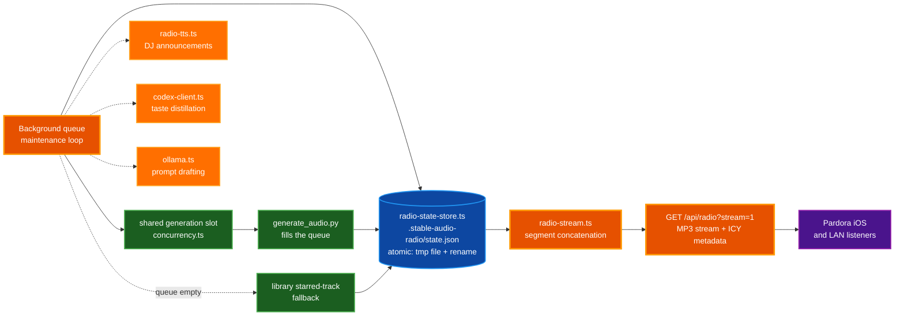

# Architecture: Stable Audio 3 Lab

Stable Audio 3 Lab is a local Next.js 16 application that drives Stability AI's Stable Audio 3 open-weight models on Apple Silicon, organized as a functional core wrapped by a thin imperative shell of API routes and subprocess bridges. It also runs a continuous, generative AI radio station whose stream and JSON contract are consumed by the Pardora iOS, watchOS, and CarPlay companion app.

## Context

The system serves two audiences on a single Apple Silicon machine: a developer testing model configurations in the browser, and the Pardora companion app listening to a never-ending generative station over the local network. Both share one generation pipeline, one on-disk library, and one assessment pipeline, so the design centralizes those concerns and exposes them through small, composable HTTP entry points.

The codebase follows a functional-core, imperative-shell split. Pure modules under `lib/` and the `lib/radio/` barrel hold schemas, normalizers, prompt builders, and state reducers with no filesystem or process side effects. The imperative shell lives in `lib/server/` and the `app/api/` routes: it owns subprocess spawning, atomic JSON writes, locks, and env reads. State is intentionally in-process and on local disk; there is no database and no multi-machine coordination. The single-machine assumption is what makes the design tractable and is also its primary constraint.

## Components

The diagram below shows the layered structure, from clients down to the vendored MLX runtime and on-disk storage. Pardora is an external consumer of the read-only radio contract.

## Generation data flow

A generation request is validated, title-resolved, serialized through a single concurrency slot, and handed to a Python subprocess that writes audio plus a metadata sidecar back to disk.

The single generation slot in `lib/server/concurrency.ts` is shared across three callers: `/api/generate`, the radio background queue generator, and every assessment invocation. With the default `STABLE_AUDIO_MAX_CONCURRENT` of one, heavy MLX inference is serialized so the machine is never asked to run two models at once. The slot is pinned to `globalThis` so it survives Next.js hot-module replacement, and it is released in a `finally` block so a crashed request can never leak a permit.

`generate_audio.py` runs in its own process group with timeout-based escalation: on expiry or a parent signal it sends SIGTERM to the whole group, waits a grace period, then escalates to SIGKILL (`terminate_process_tree`). Mock mode uses only the Python standard library so the UI works before any ML dependencies are configured, while the MLX path loads weights from the vendored `vendor/stable-audio-3/` runtime.

## Assessment data flow

Assessment runs a second Python subprocess, `scripts/audio_assessor_qwen_omni.py`, which loads Qwen2.5-Omni-7B with its speech-output talker disabled and returns structured JSON attributes (genre, instruments, mood, rhythm, tempo, key, positives, negatives). A single provider contract in `lib/audio-assessment.ts` fronts that subprocess, so Library, Radio, and the YouTube/upload reference flows all share one code path.

The contract is backed by a persisted, load-throttled queue at `.stable-audio-assessments/queue.json`. When system load (`loadavg[0] / cpus`) exceeds `AUDIO_ASSESSMENT_LOAD_THRESHOLD`, processing pauses and a 60-second retry timer re-attempts later, so assessment cannot starve generation. The queue survives dev-server restarts, dedupes jobs by filename plus rating, dead-letters jobs that fail three attempts, and shares the same single generation slot so an assessment can never run concurrently with a generation.

## Radio data flow

The station is a background queue maintenance loop that fills the lineup ahead of need, then serves the current track as a continuous MP3 stream with optional ICY metadata. All queue, taste, style, and rating state lives in one atomic JSON file.

Every state change goes through `mutateRadioState`, which acquires a per-path lock, re-reads the file inside the critical section, applies the mutation, and writes atomically via a temp file plus rename. That re-read-inside-the-lock pattern is what prevents the lost-update race where a background generation held a stale snapshot across a multi-minute run and then clobbered a thumbs-up a POST had recorded in the meantime. When the queue runs low, the loop either generates new tracks (through the shared slot) or falls back to starred library tracks. DJ announcements are produced by `radio-tts.ts` through an out-of-tree `par-tts-core-ts` module, taste is distilled from thumbs up and down ratings by `codex-client.ts`, and prompt drafting falls back to `ollama.ts`. Listeners, including Pardora, consume the read-only `GET /api/radio?stream=1` MP3 stream or the `radio.m3u` and `radio.pls` playlist endpoints.

## Security boundary

Authentication is opt-in and shared-secret based. The `proxy.ts` layer activates only when `STABLE_AUDIO_ADMIN_TOKEN` is set, and then it gates only mutating methods (POST, PUT, PATCH, DELETE) under `/api/*` with a constant-time Bearer comparison. Read-only access, including the public radio JSON contract and the MP3 stream that Pardora consumes, is left open regardless of token configuration. A per-client token-bucket rate limit (`STABLE_AUDIO_MUTATING_RATE_PER_MINUTE`) runs before auth and fails open so a cold isolate restart can never wedge the app. YouTube reference extraction is deterministic, running `yt-dlp` plus `ffmpeg` through the repo-local `youtube-audio-extract` skill with no autonomous agent. All subprocess stdout and stderr is logged server-side only and never echoed to the client, so absolute host paths and backend configuration cannot leak.

## Tradeoffs

| Choice | Benefit | Cost |
| --- | --- | --- |
| Single-machine, in-process state (no database) | Simple deployment, no coordination overhead, atomic local writes suffice | Cannot scale horizontally; state is lost if the host fails |
| Subprocess-per-generation | Strong isolation, clear timeout and SIGTERM/SIGKILL cleanup, mock mode for UI testing | Process spawn latency per request; one model loaded per run |
| Vendored MLX runtime in `vendor/stable-audio-3/` | Reproducible inference, pinned weights, no remote fetch at runtime | Large on-disk footprint; manual updates against upstream Stable Audio 3 |
| Out-of-tree `par-tts-core-ts` for TTS announcements | Decouples TTS provider work from this repository | External dependency not versioned in this tree; setup is a separate step |
| Shared single generation slot across generation, radio, and assessment | Protects Apple Silicon from concurrent model loads | Assessments queue behind active generations |

## Where to start reading the code

- **API entry points** in `app/api/`: `generate/route.ts`, `radio/route.ts`, `assess/route.ts`, and `library/route.ts` are the smallest possible imperative shells and show how each subsystem is wired.
- **`lib/generation.ts`** for the Zod request schema, model options, and `GENERATION_LIMITS` that constrain duration per model.
- **`lib/server/radio-state-store.ts`** for the atomic, locked read-modify-write pattern that all radio state flows through.
- **`lib/server/concurrency.ts`** for the single generation slot and per-client rate limit that bound load.
- **`lib/audio-assessment.ts`** for the shared assessor provider contract and the load-throttled persisted queue.
- **`scripts/generate_audio.py`** for the subprocess lifecycle, mock WAV synthesis, and MLX/PyTorch inference routing.
- **`CLAUDE.md`** for the project command reference and the conventions this architecture builds on.

## Related Documentation

- [README.md](../../README.md) - Feature-level detail and usage from the end-user perspective.
- [docs/reference/api.md](../reference/api.md) - Endpoint reference for every route under `/api/`.
- [docs/troubleshooting/common-errors.md](../troubleshooting/common-errors.md) - Diagnosis and fixes for common runtime issues.
- [CONTRIBUTING.md](../../CONTRIBUTING.md) - Contribution workflow and conventions.
- [CLAUDE.md](../../CLAUDE.md) - Project commands, subsystem overview, and key conventions.
