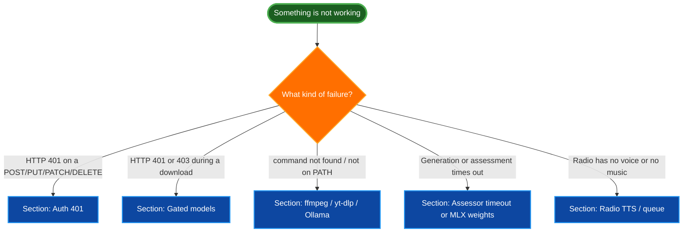

# Troubleshooting: Common Errors

Use this guide to diagnose and resolve the most common failure modes in Stable Audio 3 Lab: blocked model downloads, missing external binaries, Ollama and assessor timeouts, port conflicts, opt-in auth errors, and silent radio output. Each section follows the same layout (Symptom, Impact, Likely causes, Diagnosis, Fix, Verify, Escalate if) so you can scan to the part that matters. This resolves audit issue DOC-012.

## Table of Contents

- [Triage flow](#triage-flow)
- [Gated-model 401 or 403 on Hugging Face downloads](#gated-model-401-or-403-on-hugging-face-downloads)
- [ffmpeg or ffprobe not found](#ffmpeg-or-ffprobe-not-found)
- [yt-dlp not found (YouTube reference panel)](#yt-dlp-not-found-youtube-reference-panel)
- [Ollama not running (auto-title generation fails)](#ollama-not-running-auto-title-generation-fails)
- [Assessor first-run timeout or slow start](#assessor-first-run-timeout-or-slow-start)
- [MLX weight download failures or missing npz](#mlx-weight-download-failures-or-missing-npz)
- [Port 3007 already in use](#port-3007-already-in-use)
- [Auth: 401 Unauthorized on mutating requests](#auth-401-unauthorized-on-mutating-requests)
- [Radio: no DJ announcements or TTS silent](#radio-no-dj-announcements-or-tts-silent)
- [Radio: station queue not filling](#radio-station-queue-not-filling)
- [Still stuck?](#still-stuck)

## Triage flow

The flowchart below routes a failure to the right section by symptom. Every box points at the heading that covers it.



## Gated-model 401 or 403 on Hugging Face downloads

**Symptom:** A real-inference generation fails and the Python bridge reports an HTTP 401 or 403 from `huggingface.co`, or a message about needing to accept a model's license terms.

**Impact:** No real audio is produced. The failure happens at weight download time, before the model loads. Mock mode still works because it never touches Hugging Face.

**Likely causes:**

- You are using `STABLE_AUDIO_BACKEND=torch`, which pulls the standard gated checkpoints, and you have not accepted the Stability license terms for that model.
- `HF_TOKEN` is unset, so Hugging Face does not know who you are.
- The token is set but lacks access to the gated repository.

> **Note:** The optimized MLX weights in `stabilityai/stable-audio-3-optimized` are not gated. If you only ever run the default MLX backend, you do not need to accept gated terms, though an `HF_TOKEN` still helps avoid anonymous download rate limits.

**Diagnosis:**

```bash
# Confirm whether a token is configured.
echo "${HF_TOKEN:-<unset>}"

# Probe access to one of the gated repos. A 401/403 confirms the gate.
hf auth whoami 2>/dev/null || echo "not logged in"
```

**Fix:**

1. Accept the gated license terms on each of the three model pages (only the ones you plan to use are strictly required):
   - `https://huggingface.co/stabilityai/stable-audio-3-small-sfx`
   - `https://huggingface.co/stabilityai/stable-audio-3-small-music`
   - `https://huggingface.co/stable-audio-3-medium`
2. Authenticate the Hugging Face CLI and expose the token to the app:

   ```bash
   hf auth login
   ```

3. Add the token to `.env.local` so the Python bridge inherits it:

   ```bash
   HF_TOKEN=<your-token>
   ```

**Verify:** Start a real (non-mock) generation for the model in question. It should download weights and produce audio without an auth error.

**Escalate if:** `hf auth whoami` shows you logged in and you have accepted the terms, but downloads still return 403. That points to a token scope or account-access problem on the Hugging Face side.

## ffmpeg or ffprobe not found

**Symptom:** Generation produces a WAV but no MP3, the crop endpoint fails, duration validation reports an error, or a log line says `ffmpeg` or `ffprobe` is missing.

**Impact:** MP3 conversion, the crop/export tool, duration validation, and YouTube extraction all depend on `ffmpeg` and `ffprobe`. Without them those features fail; raw WAV generation in mock mode is unaffected.

**Likely causes:**

- `ffmpeg` and `ffprobe` are not installed.
- They are installed but not on `PATH` in the shell that launched `make dev`.

**Diagnosis:**

```bash
which ffmpeg ffprobe
ffmpeg -version | head -n 1
```

If either `which` prints nothing, the binary is not resolvable on `PATH`.

**Fix:**

Install both binaries (Homebrew ships them together):

```bash
brew install ffmpeg
```

If you cannot put them on `PATH`, point the app at them explicitly in `.env.local`. Both default to the bare names `ffmpeg` and `ffprobe`:

```bash
FFMPEG_PATH=/opt/homebrew/bin/ffmpeg
FFPROBE_PATH=/opt/homebrew/bin/ffprobe
```

Restart `make dev` after changing `.env.local`.

**Verify:** `which ffmpeg ffprobe` resolves both binaries, and a fresh generation writes both a `.wav` and an `.mp3` to `public/outputs/`.

**Escalate if:** The binaries are present and resolvable but crops or conversion still fail. Collect the exact subprocess error from the server log; the problem is likely a corrupt source file or an unsupported codec.

## yt-dlp not found (YouTube reference panel)

**Symptom:** Pasting a YouTube URL in the Reference panel fails, and the server log reports that `yt-dlp` cannot be found or exited with an error.

**Impact:** The YouTube reference-track workflow cannot fetch or analyze audio. File-drop references are unaffected because they do not use `yt-dlp`.

**Likely causes:**

- `yt-dlp` is not installed.
- `yt-dlp` is installed but not on `PATH`.
- `ffmpeg` is also required for the extraction step; a missing `ffmpeg` surfaces here too.

> **Note:** YouTube extraction is now a deterministic `yt-dlp` plus `ffmpeg` subprocess with fixed arguments. It no longer shells out to a Codex agent, so only the two binaries are required.

**Diagnosis:**

```bash
which yt-dlp
which ffmpeg
yt-dlp --version
```

**Fix:**

Install `yt-dlp` (and ensure `ffmpeg` is present, per the section above):

```bash
brew install yt-dlp
brew install ffmpeg
```

If `yt-dlp` lives somewhere other than `PATH`, set the override in `.env.local`. It defaults to the bare name `yt-dlp`:

```bash
STABLE_AUDIO_YOUTUBE_YTDLP_BIN=/opt/homebrew/bin/yt-dlp
```

The route automatically passes `--ffmpeg-location` to `yt-dlp` when `FFMPEG_PATH` points at an actual file location, so an `ffmpeg` that is not on `PATH` is still discovered as long as `FFMPEG_PATH` is set.

**Verify:** Drop a YouTube URL into the Reference panel. The server log should show `yt-dlp` downloading and converting to a temporary MP3 under `.stable-audio-assessments/uploads/`, after which the assessor runs.

**Escalate if:** `yt-dlp` and `ffmpeg` are both present but extraction still fails. The URL may be region-restricted, age-gated, or from a source `yt-dlp` does not yet support; update `yt-dlp` with `brew upgrade yt-dlp` and retry.

## Ollama not running (auto-title generation fails)

**Symptom:** Toggling auto-title during generation fails, or a request to `/api/generate-title` returns an error. The server log reports a connection refused to `127.0.0.1:11434` or a model-not-found error.

**Impact:** AI-generated titles are unavailable, so the output filename falls back to the `sa3-{mode}-{timestamp}` pattern. Explicit titles and manual generation still work.

**Likely causes:**

- The Ollama service is not running.
- Ollama is running on a different host or port than the app expects.
- The configured title model is not pulled.

**Diagnosis:**

```bash
# If this returns JSON listing models, Ollama is reachable.
curl -sS http://127.0.0.1:11434/api/tags
```

If the curl fails, the service is down or the address is wrong. The default model is `phi4-mini` (`OLLAMA_TITLE_MODEL`); the default host and port are `127.0.0.1` and `11434`.

**Fix:**

1. Start the Ollama service (the exact command depends on how you installed it):
   ```bash
   ollama serve
   ```
2. Pull the title model if it is missing:
   ```bash
   ollama pull phi4-mini
   ```
3. If your Ollama listens elsewhere, set the relevant variables in `.env.local`. A full `OLLAMA_BASE_URL` wins over the host/port pair:
   ```bash
   OLLAMA_TITLE_MODEL=phi4-mini
   OLLAMA_HOST=127.0.0.1
   OLLAMA_PORT=11434
   # or, equivalently for a non-default setup:
   # OLLAMA_BASE_URL=http://127.0.0.1:11434
   ```

**Verify:** `curl http://127.0.0.1:11434/api/tags` lists `phi4-mini`, and an auto-title request returns a creative title.

**Escalate if:** The `/api/tags` probe succeeds but title generation still errors. Check the server log for the model name and timeout; `OLLAMA_TITLE_MODEL` may point at a model you have not pulled.

## Assessor first-run timeout or slow start

**Symptom:** The first Assess click on a track hangs for minutes and then fails, or the server log shows the assessor subprocess killed after the timeout. Subsequent runs are faster.

**Impact:** Assessment attributes are not written to the track's metadata sidecar on that first run. Library playback and generation are unaffected.

**Likely causes:**

- The first run downloads the Qwen2.5-Omni-7B weights through `uv` and Hugging Face, and that download exceeds the assessor timeout.
- The timeout is left at the low code default.

> **Note:** There are two timeout values in play. The code default in `lib/server/config.ts` is `300000` (5 minutes). The shipped `.env.example` sets `900000` (15 minutes) precisely so first-run downloads complete. If your `.env.local` does not adopt that value, you are on the lower 5-minute default.

**Diagnosis:**

```bash
# What timeout is currently in effect?
grep STABLE_AUDIO_ASSESSOR_TIMEOUT_MS .env.local 2>/dev/null || echo "unset -> code default 300000ms"
# What model will load?
grep QWEN_OMNI_MODEL .env.local 2>/dev/null || echo "unset -> default Qwen/Qwen2.5-Omni-7B"
```

**Fix:**

Raise the timeout for first runs (and keep it raised if your hardware loads the model slowly). In `.env.local`:

```bash
STABLE_AUDIO_ASSESSOR_TIMEOUT_MS=900000
```

Optionally pin a different assessor model. The default is `Qwen/Qwen2.5-Omni-7B`:

```bash
QWEN_OMNI_MODEL=Qwen/Qwen2.5-Omni-7B
```

Restart `make dev` so the new value is read, then run Assess once and let the download finish.

**Verify:** A second Assess click on any track completes well inside the timeout and writes an `analysis` block into the track's `.json` sidecar.

**Escalate if:** Runs still time out after the weights are cached. The assessor may be starved for memory or contending with another inference; check unified-memory pressure and the `STABLE_AUDIO_MAX_CONCURRENT` setting.

## MLX weight download failures or missing npz

**Symptom:** A real MLX generation fails at startup with a file-not-found error for an `.npz` file, or a Hugging Face download error, possibly a 429 rate limit.

**Impact:** Real MLX generation cannot start until the weights resolve. Mock mode is unaffected.

**Likely causes:**

- The MLX runtime tried to auto-download weights and hit a network error or Hugging Face rate limit.
- The `.npz` files were never downloaded or were removed.
- Anonymous (no-token) downloads are being rate-limited.

**Diagnosis:**

```bash
# Are any MLX weights already present?
ls -la vendor/stable-audio-3/optimized/mlx/models/mlx/*.npz 2>/dev/null || echo "no .npz files symlinked"
# Is a Hugging Face token available (helps with rate limits)?
echo "${HF_TOKEN:-<unset>}"
```

**Fix:**

Pre-warm the MLX assets directly with the Hugging Face CLI, then authenticate to avoid rate limits:

```bash
hf auth login

cd ~/Repos/stable-audio-3-lab/vendor/stable-audio-3/optimized/mlx
hf download stabilityai/stable-audio-3-optimized \
  --include 'MLX/*.npz' \
  --local-dir ./hf-optimized
```

Then expose those files where the MLX runtime expects them (symlink them into `models/mlx/`). The repo's install flow can also do this for you; see the README "Optional: pre-download MLX weights" section for the full symlink script.

Restart `make dev` after the weights are in place.

**Verify:** Start a real MLX generation. It should load without a download step and produce audio.

**Escalate if:** Downloads fail even with a token and no rate limit. The optimized repo may be temporarily unavailable; check the Hugging Face status page and the repo at `https://huggingface.co/stabilityai/stable-audio-3-optimized`.

## Port 3007 already in use

**Symptom:** `make dev` exits immediately with an `EADDRINUSE` error for port 3007, or the browser loads a stale instance.

**Impact:** The dev server cannot start. No new work proceeds until the port is free.

**Likely causes:**

- A previous `make dev` is still running.
- Another process (or a second terminal running the same app) is bound to 3007.

**Diagnosis:**

```bash
lsof -i :3007
```

The output names the process holding the port.

**Fix:**

Stop any prior instance with the helper target, which kills whatever holds 3007:

```bash
make dev-stop
```

Then start fresh:

```bash
make dev
```

If you need to run two instances at once, move this app to a different port. The port defaults to 3007 and is overridden with `PORT`:

```bash
PORT=3008 make dev
```

**Verify:** `lsof -i :3007` shows the new Next.js process, and `http://localhost:3007` loads the app.

**Escalate if:** `make dev-stop` cannot kill the holder (for example, it is owned by another user or a system service). Use `lsof -i :3007` to identify it and stop that process directly.

## Auth: 401 Unauthorized on mutating requests

**Symptom:** `POST`, `PUT`, `PATCH`, or `DELETE` requests to `/api/*` return `401 Unauthorized` with a `WWW-Authenticate: Bearer realm="stable-audio-3-lab"` header. `GET` requests still work, including the public `/api/radio` JSON and the `?stream=1` MP3 stream.

**Impact:** Generation, library edits, crops, assessment, and bundle exports are blocked. Read-only access, including Pardora consuming the station, is unaffected.

**Likely causes:**

- `STABLE_AUDIO_ADMIN_TOKEN` is set in the environment, which activates opt-in bearer-token auth on mutating routes, and the request does not carry a matching `Authorization: Bearer <token>` header.
- The header is present but the token value does not match.

> **Security:** Auth is opt-in and off by default. When `STABLE_AUDIO_ADMIN_TOKEN` is unset (the intended localhost, single-user mode), no auth is required and all routes work as before. Only mutating methods are ever gated; read-only `GET` routes are never gated regardless of whether a token is configured.

**Diagnosis:**

```bash
# Is the token active? (Do not print its value.)
if [ -n "${STABLE_AUDIO_ADMIN_TOKEN:-}" ]; then echo "AUTH ON"; else echo "auth off (open mode)"; fi
```

**Fix:**

Pick one of the two modes:

- **Send the header.** Include the operator-configured token on every mutating request:
  ```bash
  curl -X POST http://localhost:3007/api/generate \
    -H "Authorization: Bearer ${STABLE_AUDIO_ADMIN_TOKEN}" \
    -H "Content-Type: application/json" \
    -d '{"prompt":"test","mode":"music"}'
  ```
- **Disable auth for localhost single-user mode.** Unset the token in `.env.local` and restart `make dev`:
  ```bash
  # Remove or comment out the STABLE_AUDIO_ADMIN_TOKEN line, then:
  make dev-restart
  ```

> **Note:** If you see `429 Too Many Requests` instead of 401, you are hitting the per-client mutating rate limit (`STABLE_AUDIO_MUTATING_RATE_PER_MINUTE`, default 30). That is separate from auth; raise the limit or wait and retry.

**Verify:** A mutating request with the correct bearer header succeeds (or, in open mode, any mutating request succeeds without a header).

**Escalate if:** You are sure the header and token match exactly but 401 persists. The token comparison is constant-time and case-sensitive, so confirm there is no trailing whitespace or newline in the `.env.local` value.

## Radio: no DJ announcements or TTS silent

**Symptom:** The station stream plays music, but DJ announcements never appear. The server log records that an announcement was skipped because the TTS module could not be loaded.

**Impact:** The station runs without voice breaks; music generation and streaming are unaffected.

**Likely causes:**

- The TTS pipeline is provided by the out-of-tree `par-tts-core-ts` package, which is not declared in `package.json` and is not installed with the app. If `RADIO_TTS_MODULE_PATH` (or `RADIO_TTS_NODE_MODULE_PATH` for Kokoro) is unset, announcements are skipped on purpose rather than crashing the stream.
- The module path is set but the provider API key is missing, so the provider call fails.
- The provider key is set in the wrong file. Keys are read from process environment (`.env.local`), not from `~/.claude/.env`.

**Diagnosis:**

```bash
# Are the TTS module paths set?
grep -E 'RADIO_TTS_(MODULE_PATH|NODE_MODULE_PATH|MODEL)' .env.local 2>/dev/null || echo "TTS module paths unset -> announcements skipped"
# Are provider keys present in .env.local (the only place the app reads them)?
grep -E 'OPENAI_API_KEY|ELEVENLABS_API_KEY|DEEPGRAM_API_KEY|DG_API_KEY|GEMINI_API_KEY|GOOGLE_API_KEY' .env.local 2>/dev/null || echo "no provider keys in .env.local"
```

**Fix:**

1. Build or locate `par-tts-core-ts` and point the app at its CommonJS entry. For the standard providers (`openai`, `elevenlabs`, `deepgram`, `gemini`):
   ```bash
   RADIO_TTS_MODULE_PATH=/Users/<you>/Repos/par-tts-core-ts/dist/index.cjs
   ```
   For Kokoro ONNX, use the Node-specific entry:
   ```bash
   RADIO_TTS_NODE_MODULE_PATH=/Users/<you>/Repos/par-tts-core-ts/dist/node/index.cjs
   ```
2. Add the provider key to `.env.local` for your chosen provider. Kokoro needs no key:
   ```bash
   OPENAI_API_KEY=<your-key>
   # or ELEVENLABS_API_KEY / DEEPGRAM_API_KEY / DG_API_KEY / GEMINI_API_KEY / GOOGLE_API_KEY
   ```
3. Restart `make dev`.

> **Tip:** Provider keys are resolved in this order: the `par-tts` config file pointed at by `PAR_TTS_CONFIG_PATH`, then process environment. Put keys in `.env.local`, not in `~/.claude/.env`.

**Verify:** Trigger or wait for a DJ break. The server log should show the TTS provider invoked and an announcement clip generated, and the stream should include the voice break.

**Escalate if:** The module path resolves and a key is set, but announcements still fail. Inspect the server log for the provider's error (quota, invalid key, or unsupported voice) and confirm the provider name in code matches a key you have set.

## Radio: station queue not filling

**Symptom:** `GET /api/radio` returns a queue that stays empty or never grows, and the stream runs out of tracks to play.

**Impact:** The station goes silent once the current track ends. Generation on demand from the UI is unaffected.

**Likely causes:**

- Background auto-fill is disabled by setting `RADIO_QUEUE_AUTO_FILL=false`.
- The single generation slot is busy (the default `STABLE_AUDIO_MAX_CONCURRENT=1`), so the queue cannot refill while another generation or assessment is running.
- Generation itself is failing for one of the reasons in the sections above (missing weights, Ollama down, etc.), so fill attempts never produce tracks.

**Diagnosis:**

```bash
# Is auto-fill disabled?
grep RADIO_QUEUE_AUTO_FILL .env.local 2>/dev/null || echo "unset -> auto-fill enabled"
# Is concurrency capped at one heavy subprocess?
grep STABLE_AUDIO_MAX_CONCURRENT .env.local 2>/dev/null || echo "unset -> default 1"
```

Also watch the server log while the station runs: a healthy fill loop logs generation attempts and queue growth.

**Fix:**

1. Make sure auto-fill is not disabled. Either unset the variable or set it to `true`:
   ```bash
   RADIO_QUEUE_AUTO_FILL=true
   ```
2. If you have the memory for it, allow a second heavy subprocess so the queue can refill while you generate on demand:
   ```bash
   STABLE_AUDIO_MAX_CONCURRENT=2
   ```
   Raise this only on hardware that can host multiple inferences without exhausting unified memory.
3. Restart `make dev` and confirm the underlying generation path works (for example, generate one track from the UI).

**Verify:** `GET /api/radio` shows the queue growing toward its target depth, and the stream plays continuously without gaps.

**Escalate if:** Auto-fill is enabled and generation works from the UI, but the queue still empties. The fill loop may be erroring on prompt drafting; check the log for Ollama or Codex failures (the station uses Ollama for prompt drafting and `codex` for taste distillation).

## Still stuck?

If none of the sections above match, work outward from these sources:

- **[README.md](../../README.md)** is the project's source of truth for prerequisites, installation, real-inference setup, the full environment-variable reference, and the FAQ. Start there for setup and configuration questions.
- **[docs/reference/api.md](../reference/api.md)** documents every `/api/*` route, including request and response shapes and error tables, which helps when a failure is specific to one endpoint.
- **[CONTRIBUTING.md](../../CONTRIBUTING.md)** covers the development workflow, verification gates, and commit conventions.
- **Run the local gate.** Before reporting an issue, run `make checkall` (Vitest plus Python unittest, then a production build). Many environment and type problems surface there first, and a clean `make checkall` is the baseline expected for any bug report.
